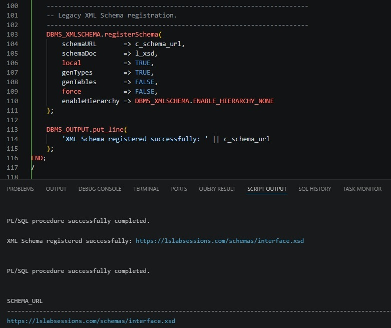
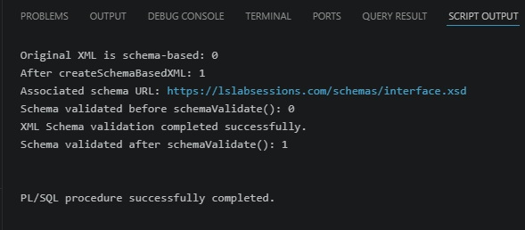
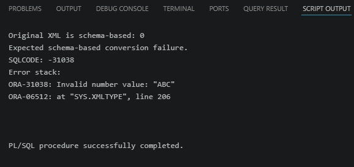
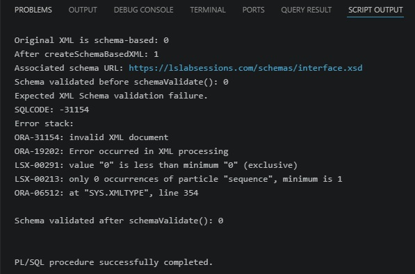
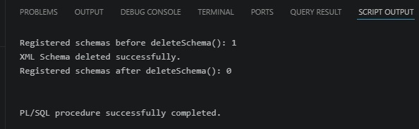
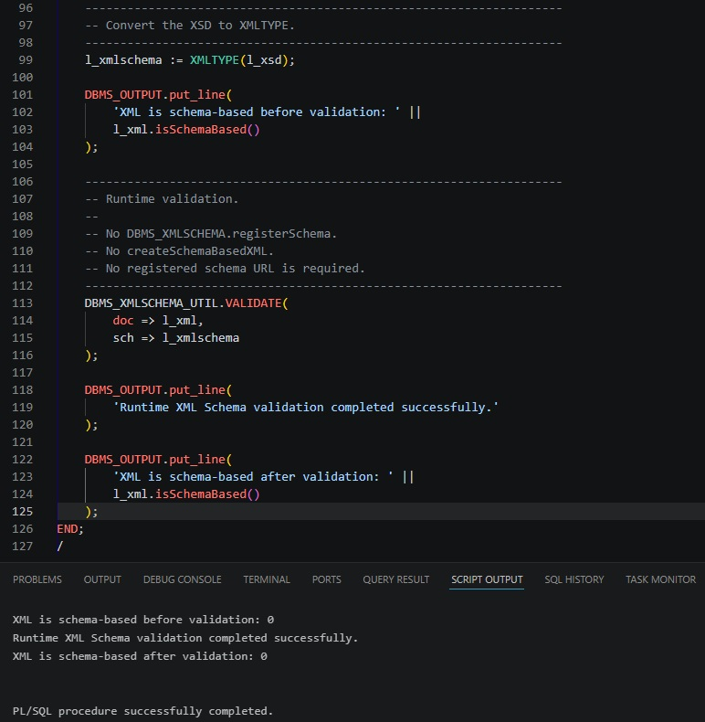
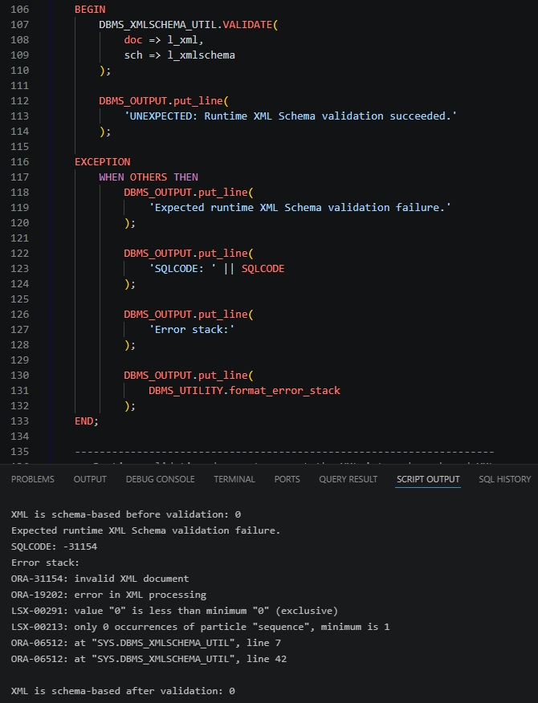
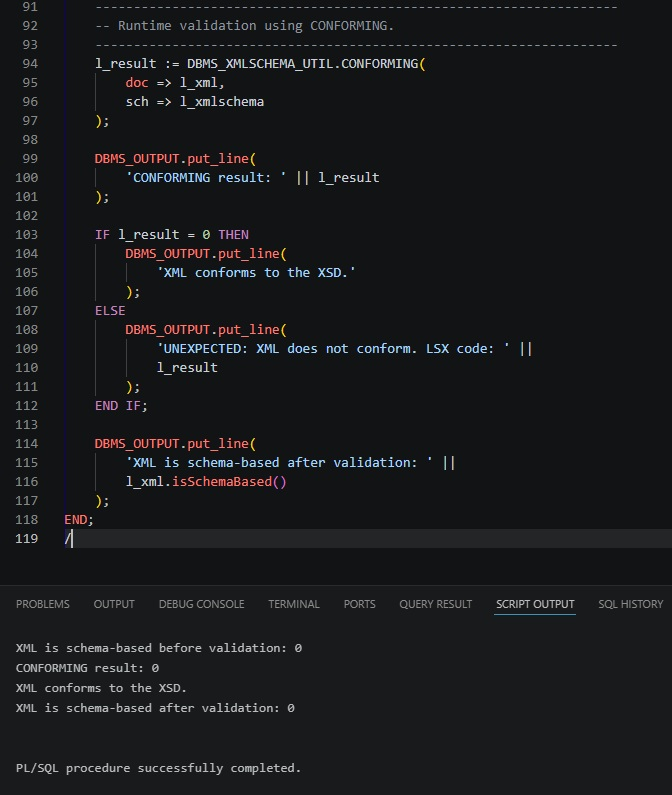
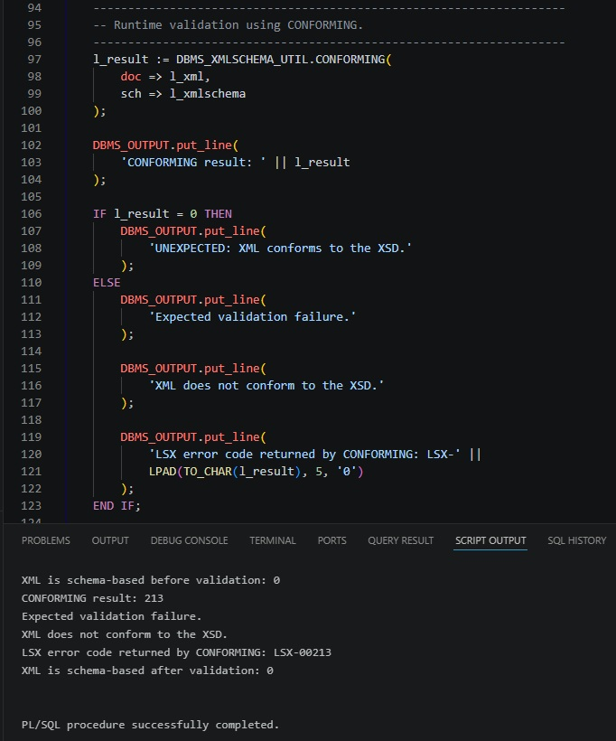
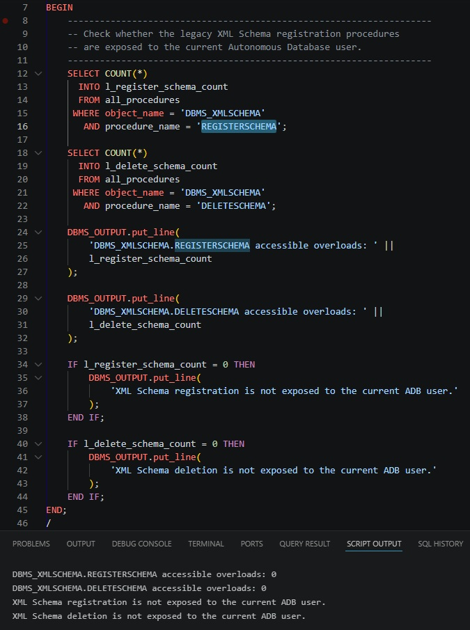

# Runtime XML Schema Validation in Oracle Autonomous AI Database

A hands-on migration lab that compares **registered XSD validation in Oracle Database 19c (non-ADB)** with **runtime XSD validation in Oracle Autonomous AI Database**.

The lab starts with a traditional Oracle XML DB pattern based on `DBMS_XMLSCHEMA.registerSchema`, schema-based `XMLType`, and `schemaValidate()`. It then validates the **same XML contract** in Autonomous AI Database using `DBMS_XMLSCHEMA_UTIL.VALIDATE` and `DBMS_XMLSCHEMA_UTIL.CONFORMING`, without registering the XSD.

## Why this lab exists

Oracle Autonomous AI Database does not support XML Schema Registration. Oracle documents Binary XML as supported only for non-schema-based XML and points to `DBMS_XMLSCHEMA_UTIL` for runtime validation when an application still needs to validate XML documents against XSDs.

That creates a migration question for applications that previously used code such as:

```sql
DBMS_XMLSCHEMA.registerSchema(...);

l_schema_based_xml :=
    l_xml.createSchemaBasedXML(c_schema_url);

l_schema_based_xml.schemaValidate();
```

This repository demonstrates a practical replacement pattern.

## What this lab demonstrates

- How registered XML Schema validation works in Oracle Database 19c (non-ADB).
- The difference between **schema-based** and **schema-validated** `XMLType` instances.
- Why an invalid XML datatype can fail before full schema validation.
- Why a valid datatype can still fail an XSD facet constraint.
- How to validate XML against an unregistered XSD with `DBMS_XMLSCHEMA_UTIL.VALIDATE`.
- How `DBMS_XMLSCHEMA_UTIL.CONFORMING` differs from `VALIDATE` in error handling.
- What changes when migrating a registered-XSD validation flow to Autonomous AI Database.

## Tested scenarios

The legacy part of the lab was executed on **Oracle Database 19c (non-ADB)**. The runtime-validation part was executed on **Oracle Autonomous AI Database**.

The repository intentionally uses the same XML namespace and XSD rules in both environments so that the validation mechanism, rather than the XML contract, is the variable under test.

## XML contract used by the lab

The XML namespace is:

```text
https://lslabsessions.com/xml/order/v1
```

The legacy registered schema URL is:

```text
https://lslabsessions.com/schemas/interface.xsd
```

These values serve different purposes. The namespace identifies the XML vocabulary; the schema URL identifies the XSD registered in Oracle XML DB in the legacy portion of the lab. See [`docs/concepts.md`](docs/concepts.md).

The XSD defines:

- `orderId` as `xs:positiveInteger`.
- `customer` as a non-empty string with a maximum length of 100.
- `amount` as `xs:decimal` with `xs:minExclusive value="0"`.
- `currency` as a required attribute limited to `EUR`, `USD`, or `GBP`.

## Repository structure

```text
adb-xml-xsd-runtime-validation/
├── README.md
├── legacy/
│   ├── 001-register-schema.sql
│   ├── 002-validate-valid-xml.sql
│   ├── 003-invalid-datatype-conversion.sql
│   ├── 004-schema-validate-invalid-facet.sql
│   └── 005-delete-schema.sql
├── adb/
│   ├── 001-runtime-validate-valid.sql
│   ├── 002-runtime-validate-invalid.sql
│   ├── 003-conforming-valid.sql
│   ├── 004-conforming-invalid.sql
│   └── 005-no-schema-registration.sql
├── xml/
│   ├── order-valid.xml
│   ├── order-invalid-order-id.xml
│   └── order-invalid-amount-zero.xml
├── xsd/
│   └── interface.xsd
└── docs/
    ├── concepts.md
    ├── migration-guide.md
    └── screenshots/
        ├── README.md
        └── 001-...jpg through 010-...jpg
```

## Part 1 — Oracle Database 19c (non-ADB): registered-schema validation

### 1. Register the XSD

Run:

```text
legacy/001-register-schema.sql
```

The script registers the XSD with:

```sql
DBMS_XMLSCHEMA.registerSchema(
    schemaURL       => c_schema_url,
    schemaDoc       => l_xsd,
    local           => TRUE,
    genTypes        => TRUE,
    genTables       => FALSE,
    force           => FALSE,
    enableHierarchy => DBMS_XMLSCHEMA.ENABLE_HIERARCHY_NONE
);
```

It then confirms the registration through `USER_XML_SCHEMAS`.



### 2. Convert a valid document to schema-based XML and validate it

Run:

```text
legacy/002-validate-valid-xml.sql
```

The script deliberately starts with an XML document that has the correct namespace but no `xsi:schemaLocation`. This makes the state transition explicit:

```text
Original XML is schema-based: 0
After createSchemaBasedXML: 1
Schema validated before schemaValidate(): 0
Schema validated after schemaValidate(): 1
```



This demonstrates an important distinction:

```text
schema-based != schema-validated
```

`createSchemaBasedXML()` associates the document with the registered XSD. `schemaValidate()` performs full schema validation and, on success, changes the validation state.

### 3. Invalid datatype: failure during schema-based XML evaluation

Run:

```text
legacy/003-invalid-datatype-conversion.sql
```

The invalid document contains:

```xml
<ord:orderId>ABC</ord:orderId>
```

while the XSD requires `xs:positiveInteger`.

In the tested Oracle Database 19c (non-ADB) environment, evaluation of the schema-based `XMLType` raises:

```text
ORA-31038: Invalid number value: "ABC"
```



The key point is that a value that cannot be represented as the schema datatype can fail before the explicit full-validation step.

### 4. Valid datatype, invalid facet: failure during full schema validation

Run:

```text
legacy/004-schema-validate-invalid-facet.sql
```

This document uses:

```xml
<ord:amount currency="EUR">0</ord:amount>
```

`0` is a valid `xs:decimal`, so conversion to schema-based XML succeeds. However, the XSD contains:

```xml
<xs:minExclusive value="0"/>
```

Full validation therefore fails with `ORA-31154`. In the tested environment the error stack also contained `LSX-00291` and `LSX-00213`.



This gives the lab two deliberately different negative cases:

| Case | XML value | XSD rule | Observed failure point |
|---|---|---|---|
| Invalid datatype | `orderId = ABC` | `xs:positiveInteger` | schema-based XML evaluation (`ORA-31038`) |
| Invalid facet | `amount = 0` | `xs:decimal`, `minExclusive=0` | `schemaValidate()` (`ORA-31154`) |

### 5. Delete the registered schema

Run:

```text
legacy/005-delete-schema.sql
```

The lab cleans up with `DBMS_XMLSCHEMA.deleteSchema(..., DBMS_XMLSCHEMA.DELETE_CASCADE)` and confirms that the registered schema count goes from `1` to `0`.



## Part 2 — Autonomous AI Database runtime validation

In Autonomous AI Database the XSD is supplied directly to the validation API as `XMLType`. It is not registered first.

### 1. `VALIDATE` with a valid XML document

Run:

```text
adb/001-runtime-validate-valid.sql
```

Core call:

```sql
DBMS_XMLSCHEMA_UTIL.VALIDATE(
    doc => l_xml,
    sch => l_xmlschema
);
```

The tested result shows that the document remains non-schema-based before and after validation:

```text
XML is schema-based before validation: 0
Runtime XML Schema validation completed successfully.
XML is schema-based after validation: 0
```



### 2. `VALIDATE` with an invalid XML document

Run:

```text
adb/002-runtime-validate-invalid.sql
```

The script uses the same `amount = 0` facet violation as the legacy full-validation test.

`VALIDATE` signals invalid XML through an exception. The tested result was:

```text
ORA-31154: invalid XML document
```

with an LSX error stack that included the facet violation.



### 3. `CONFORMING` with a valid XML document

Run:

```text
adb/003-conforming-valid.sql
```

Core call:

```sql
l_result := DBMS_XMLSCHEMA_UTIL.CONFORMING(
    doc => l_xml,
    sch => l_xmlschema
);
```

For the valid document the function returns:

```text
CONFORMING result: 0
```



### 4. `CONFORMING` with an invalid XML document

Run:

```text
adb/004-conforming-invalid.sql
```

For the same `amount = 0` invalid document, the tested environment returned:

```text
CONFORMING result: 213
LSX error code returned by CONFORMING: LSX-00213
```



The lab records `213 / LSX-00213` as the **observed result**, not as a hard-coded universal expectation. The API contract is that zero means conforming and a non-zero LSX validation code means non-conforming.

## `VALIDATE` vs `CONFORMING`

Both APIs validate an XML instance against an XSD supplied at runtime and do not require schema registration. The main practical difference is how they report invalid documents.

| Behavior | `DBMS_XMLSCHEMA_UTIL.VALIDATE` | `DBMS_XMLSCHEMA_UTIL.CONFORMING` |
|---|---|---|
| Valid XML | Completes normally | Returns `0` |
| Invalid XML | Raises `ORA-31154` | Returns a non-zero LSX code |
| Error detail in this lab | Detailed Oracle/LSX stack | Numeric LSX result |
| Useful when | Exception-based validation and detailed diagnostics are useful | Programmatic pass/fail checks without using an exception for ordinary non-conformance |

For the same invalid `amount = 0` test, `VALIDATE` exposed a fuller error stack, while `CONFORMING` returned `213` (`LSX-00213`) in the tested environment.

## 5. Check legacy registration API visibility in ADB

Run:

```text
adb/005-no-schema-registration.sql
```

The script checks `ALL_PROCEDURES` for `DBMS_XMLSCHEMA.REGISTERSCHEMA` and `DBMS_XMLSCHEMA.DELETESCHEMA` as visible to the current ADB user. In the tested environment both counts were zero.



This is **environment evidence**, not the basis for the general product statement. The general statement comes from Oracle's Autonomous AI Database documentation: XML Schema Registration is not supported, while runtime validation is available through `DBMS_XMLSCHEMA_UTIL`.

## Migration summary

The migration pattern demonstrated by this repository is:

```text
Oracle Database 19c (non-ADB)
-----------------------------
XSD
 |
DBMS_XMLSCHEMA.registerSchema
 |
registered XML Schema
 |
XMLType.createSchemaBasedXML
 |
XMLType.schemaValidate
 |
DBMS_XMLSCHEMA.deleteSchema
```

becomes:

```text
Autonomous AI Database
----------------------
XML document + XSD
        |
        +--> DBMS_XMLSCHEMA_UTIL.VALIDATE
        |
        +--> DBMS_XMLSCHEMA_UTIL.CONFORMING

No XSD registration
No schema-based XMLType conversion
No registered-schema cleanup
```

See [`docs/migration-guide.md`](docs/migration-guide.md) for a code-oriented migration checklist.

## Run order

For the Oracle Database 19c (non-ADB) portion:

```text
001-register-schema.sql
002-validate-valid-xml.sql
003-invalid-datatype-conversion.sql
004-schema-validate-invalid-facet.sql
005-delete-schema.sql
```

For Autonomous AI Database:

```text
001-runtime-validate-valid.sql
002-runtime-validate-invalid.sql
003-conforming-valid.sql
004-conforming-invalid.sql
005-no-schema-registration.sql
```

## Notes about the embedded XSD

The SQL scripts embed the XSD to keep the lab self-contained and immediately reproducible. In a real implementation, the XSD could instead be stored in a CLOB column or obtained from another application-managed source.

The standalone copy is available at [`xsd/interface.xsd`](xsd/interface.xsd). The XML declaration is intentionally omitted from the XSD embedded in PL/SQL literals so that leading whitespace in a quoted literal cannot accidentally precede `<?xml ...?>` and trigger an XML parser error.

## Documentation

- [`docs/concepts.md`](docs/concepts.md) — namespace vs schema URL, schema-based vs schema-validated, datatype vs facet failures, and runtime-validation semantics.
- [`docs/migration-guide.md`](docs/migration-guide.md) — before/after migration patterns and a migration checklist.
- [`docs/screenshots/README.md`](docs/screenshots/README.md) — what each screenshot proves.

## Oracle documentation references

- [Autonomous AI Database — Oracle XML DB](https://docs.oracle.com/en-us/iaas/autonomous-database-serverless/doc/autonomous-xml-db.html)
- [Oracle Database 26ai — DBMS_XMLSCHEMA_UTIL](https://docs.oracle.com/en/database/oracle/oracle-database/26/arpls/DBMS_XMLSCHEMA_UTIL.html)
- [Oracle Database 19c — DBMS_XMLSCHEMA_UTIL](https://docs.oracle.com/en/database/oracle/oracle-database/19/arpls/DBMS_XMLSCHEMA_UTIL.html)
- [Oracle Database 19c — DBMS_XMLSCHEMA](https://docs.oracle.com/en/database/oracle/oracle-database/19/arpls/DBMS_XMLSCHEMA.html)
- [Oracle Database 19c — XMLTYPE](https://docs.oracle.com/en/database/oracle/oracle-database/19/arpls/XMLTYPE.html)
- [Oracle XML DB Developer's Guide — XML Schema Storage and Query](https://docs.oracle.com/en/database/oracle/oracle-database/19/adxdb/XML-Schema-and-query-basic.html)

## Scope

This lab focuses on a single XSD and a small XML contract so that the migration behavior is easy to reproduce and inspect. It is intended as a technical migration pattern rather than a complete XML integration framework.
